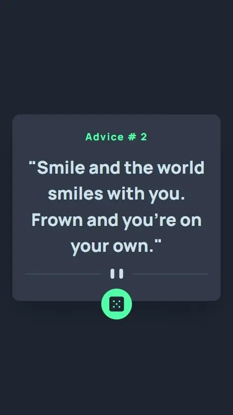
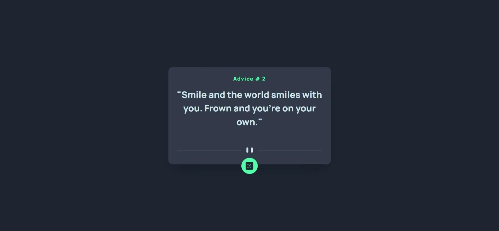

# Frontend Mentor - Advice generator app solution

This is a solution to the [Advice generator app challenge on Frontend Mentor](https://www.frontendmentor.io/challenges/advice-generator-app-QdUG-13db). Frontend Mentor challenges help you improve your coding skills by building realistic projects.

## Table of contents

- [Overview](#overview)
  - [The challenge](#the-challenge)
  - [Screenshot](#screenshot)
  - [Links](#links)
- [My process](#my-process)
  - [Built with](#built-with)
  - [What I learned](#what-i-learned)
  - [Continued development](#continued-development)
  - [Useful resources](#useful-resources)
- [Author](#author)
- [Acknowledgments](#acknowledgments)

## Overview

### The challenge

Users should be able to:

- View the optimal layout for the app depending on their device's screen size
- See hover states for all interactive elements on the page
- Generate a new piece of advice by clicking the dice icon

### Screenshot

### Links

- Solution URL: [GitHub](https://github.com/TuanAnh45468/advice-generator)
- Live Site URL: [Netlify](https://advice-generator-tuananh.netlify.app/)

## My process

### Built with

- Semantic HTML5 markup
- CSS custom properties
- Flexbox
- Mobile-first workflow
- [TailwindCSS](https://tailwindcss.com/) - For styles

### Useful resources

- [Tailwindcss cheatsheet](https://tailwindcomponents.com/cheatsheet/) 
- [Hammer.js](https://hammerjs.github.io/getting-started/)
## Author

- Website - [Tuan Anh](https://tuananhportfolio.netlify.app/)
- Frontend Mentor - [@Tuananh45468](https://www.frontendmentor.io/profile/Tuananh45468)